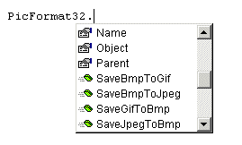



## PicFormat32

### Description

With the PicFormat32 OCX/DLL combo you can Save a BMP file to a GIF, GIF to a BMP, BMP to a JPEG, and JPEG to a BMP!!

SaveBmpToGif

SaveGifToBmp

SaveBmpToJpeg

SaveJpegToBmp

If you like the code please vote.

Send all GOOD and BAD feedback to edo@theblackhand.net
 
### More Info
 

             |
---                |---
**Submitted On**   |2000-10-11 15:30:32
**By**             |[Edward Grubb \(\-ed0\-\)](https://github.com/Planet-Source-Code/PSCIndex/blob/master/ByAuthor/edward-grubb-ed0.md)
**Level**          |Intermediate
**User Rating**    |4.3 (133 globes from 31 users)
**Compatibility**  |VB 6\.0
**Category**       |[OLE/ COM/ DCOM/ Active\-X](https://github.com/Planet-Source-Code/PSCIndex/blob/master/ByCategory/ole-com-dcom-active-x__1-29.md)
**World**          |[Visual Basic](https://github.com/Planet-Source-Code/PSCIndex/blob/master/ByWorld/visual-basic.md)
**Archive File**   |[CODE\_UPLOAD122651222000\.zip](https://github.com/Planet-Source-Code/edward-grubb-ed0-picformat32__1-13267/archive/master.zip)

